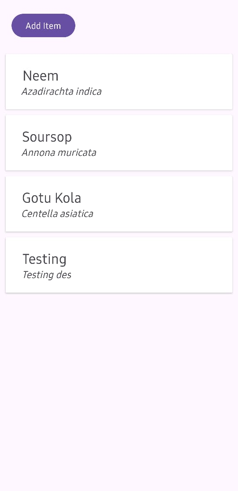
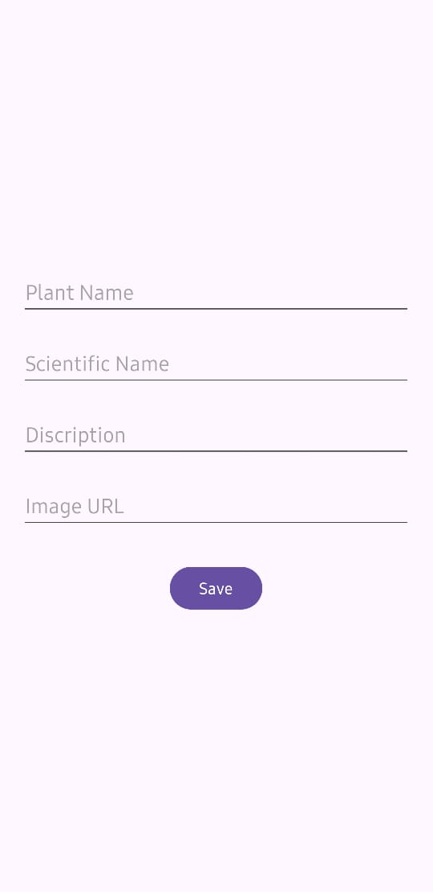

# Herbal Plants Showcase App

This Android application allows users to explore various herbal plants found in Sri Lanka. Users can view a list of plants, access detailed information about each plant, add new plants, and delete existing ones.

## Features

- Display a list of herbal plants in a RecyclerView on the main screen.
- Clicking on a plant item opens a detailed view showing more information about the selected plant.
- Add new plants using a form accessed via the "Add Item" button on the home screen.
- Long-pressing on a plant item triggers a confirmation dialog to delete the selected plant.

## Screenshots

<center>






</center>

## Technologies Used

- **Android Studio**: The app is developed using Android Studio IDE.
- **Kotlin**: Programming language used for implementing app logic.
- **RecyclerView**: Used to display the list of herbal plants efficiently.
- **Intents**: Employed for navigating between screens and passing data.
- **Dialogs**: Confirmation dialog for deleting items.
- **SQLite Database**: Used for data storage.

## Setup

To run this project, follow these steps:

1. Clone the repository to your local machine.

   ```bash
   git clone https://github.com/your_username/herbal-plants-showcase.git

   ```

2. Open the project in Android Studio.

3. Connect a physical device or start an emulator.

4. Build and run the project on the device/emulator.

## Usage

<ul>
  <li>Launch the app on your device/emulator.</li>
  <li>Browse through the list of herbal plants.</li>
  <li>Click on a plant to view detailed information.</li>
  <li>To add a new plant, click on the "Add Item" button and fill out the required fields.</li>
  <li>To delete a plant, long-press on the plant item and confirm the deletion in the dialog.</li>
</ul>

## Contributing

<p>Contributions are welcome! Please follow these steps to contribute:</p>

<ol>
  <li>Fork the project.</li>
  <li>Create your feature branch (git checkout -b feature/AmazingFeature).</li>
  <li>Commit your changes (git commit -m 'Add some AmazingFeature').</li>
  <li>Push to the branch (git push origin feature/AmazingFeature).</li>
  <li>Open a pull request.</li>
</ol>
